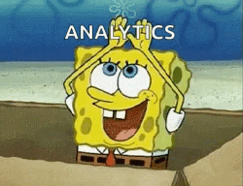

<table>
  <tr>
    <td width="60%">

### 👩‍💻 Дарья Фролова  
**Middle Data Analyst**

Аналитик данных полного цикла:  
от постановки задачи и проверки гипотез  
до разработки и внедрения решений.

- EDA  
- ML-модели  
- SQL-аналитика  
- Автоматизация процессов  

    </td>
    <td width="40%">
      
    </td>
  </tr>
</table>

### Для связи со мной:

### Мой стек: 

 ### DATA-проекты: Раздел в процессе активного наполнения и улучшения

[Customer Segmentation & Revenue Growth Strategy](https://github.com/daryafralova/data_projects/tree/main/Segmentation(RFM)) 

[Marketing_Response(предсказание отклика)](https://github.com/daryafralova/ML_projects/blob/main/Marketing_Response/README.md)

[Iris_Patient_Identification](https://github.com/daryafralova/data_projects/tree/main/Iris_authentification)

### Диплом и сертификаты:

[Сертификаты](https://github.com/daryafralova/diploma-and-certificates)

